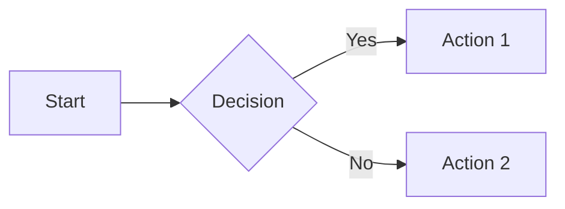
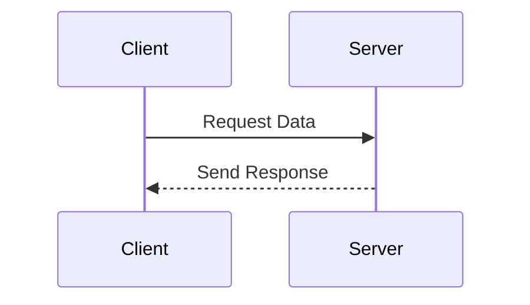
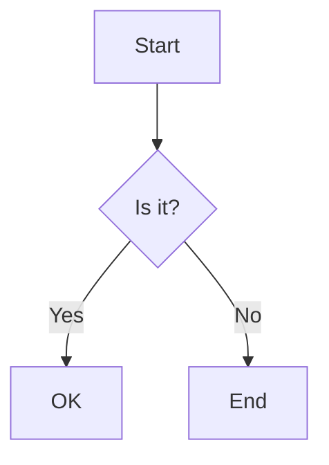

# Style Guide

A comprehensive demonstration of available styling elements and components in Material for MkDocs.

## Text Formatting

Basic text formatting options:

- **Bold text** using `**double asterisks**`
- *Italic text* using `*single asterisks*`
- ***Bold and italic*** using `***triple asterisks***`
- ~~Strikethrough~~ using `~~double tildes~~`
- `Inline code` using `backticks`
- ==Highlighted text== using `==double equals==`
- [Links](https://example.com) using `[text](url)`
- Footnotes[^footnote] using `[^footnote]`

[^footnote]: This is an example footnote with more detailed content.

## Admonitions

!!! note "Custom Note Title"
    A note block with a custom title.

!!! info
    An info block.

!!! warning
    A warning block.

!!! danger
    A danger block.

!!! success
    A success block.

??? tip "Collapsible Block"
    This block can be collapsed/expanded.

???+ example "Expanded by Default"
    This block starts expanded.

## Code Blocks

```python title="example.py" linenums="1" hl_lines="2 3"
def example_function():
    """Example docstring for demonstration"""
    return "Hello, World!"
```

```javascript title="calculator.js" linenums="1"
// With line numbers
function calculateVolume(length, width, height) {
  return length * width * height;
}
```

## Tables

### Standard Table
| Material | Density (g/cm³) | Tensile Strength (MPa) |
|----------|----------------|----------------------|
| PEEK     | 1.32          | 100                  |
| PPS      | 1.35          | 82                   |
| PTFE     | 2.20          | 31                   |

### Table Alignment
| Left | Center | Right |
|:-----|:------:|------:|
|Left-aligned|Centered|Right-aligned|
|text|text|text|

## Lists

### Unordered Lists
- First level
    - Second level
        - Third level
    - Back to second
- Back to first

### Ordered Lists
1. First item
    1. Sub-item A
    2. Sub-item B
2. Second item
3. Third item

### Task Lists
- [x] Completed task
- [ ] Pending task
- [ ] Future task

## Buttons

[Subscribe to newsletter](#){ .md-button }
[Learn More](#){ .md-button .md-button--primary }

## Tabs

=== "Tab 1"
    Content for tab 1

=== "Tab 2"
    Content for tab 2

=== "Tab 3"
    Content for tab 3

## Diagrams



## Keyboard Keys

++ctrl+alt+del++

## Mathematical Equations

Inline equation: $E = mc^2$

Block equation:

$$
\frac{n!}{k!(n-k)!} = \binom{n}{k}
$$

## Tooltips

[Hover me](https://example.com "I'm a tooltip!")

## Icons and Emojis

### Material Design Icons
- :material-account-circle: User Profile
- :material-alert: Warning Alert
- :material-check: Success Check
- :material-cloud-download: Download
- :material-github: GitHub

### Social Icons
- :fontawesome-brands-twitter: Twitter
- :fontawesome-brands-linkedin: LinkedIn
- :fontawesome-brands-youtube: YouTube

### Common Emojis
- :smile: Smile
- :rocket: Rocket
- :computer: Computer
- :bulb: Idea
- :warning: Warning

### Icon Sizing
- :material-account-circle:{ .md-18 } Small
- :material-account-circle:{ .md-24 } Normal
- :material-account-circle:{ .md-36 } Large
- :material-account-circle:{ .md-48 } Extra Large

### Icon Colors
- :material-check:{ .success } Success
- :material-close:{ .error } Error
- :material-alert:{ .warning } Warning
- :material-info:{ .info } Info

## Content Tabs

=== "Material Properties"
    Properties of common materials:
    
    - Density
    - Tensile Strength
    - Melting Point

=== "Processing Parameters"
    Common processing parameters:
    
    - Temperature
    - Pressure
    - Cycle Time

=== "Applications"
    Common applications:
    
    - Aerospace
    - Medical
    - Industrial

## Custom Containers

!!! abstract "Summary"
    A summary or abstract block

!!! quote "Customer Testimonial"
    A customer testimonial or important quote

!!! bug "Known Issues"
    List of known issues or bugs

## Definition Lists

Material
: A substance or mixture of substances that constitutes an object

Property
: A characteristic or attribute of a material that can be measured or observed

## Horizontal Rule

---

## Images


{ .center }

## Advanced Admonitions

!!! note ""
    A note without title

!!! info inline end "Inline End"
    This admonition appears inline at the end

!!! tip inline "Inline"
    This is an inline admonition

!!! note "Nested Admonitions"
    Outer admonition
    !!! warning
        Nested warning

## Advanced Diagrams





## Advanced Math

Inline math with alignment:

$$
\begin{aligned}
a &= b + c \\
  &= d + e
\end{aligned}
$$

Matrix:

$$
\begin{bmatrix}
1 & 2 & 3 \\
4 & 5 & 6 \\
7 & 8 & 9
\end{bmatrix}
$$

## Advanced Content Tabs

=== "C++"

    ```cpp
    #include <iostream>
    
    int main() {
        std::cout << "Hello World!";
        return 0;
    }
    ```

=== "Python"

    ```python
    print("Hello World!")
    ```

=== "JavaScript"

    ```javascript
    console.log("Hello World!");
    ```

## Grid Cards

<div class="grid cards" markdown>

- :material-clock-fast:{ .lg .middle } __Set up in 5 minutes__

    ---

    Install Material for MkDocs with pip and get up
    and running in minutes

    [:octicons-arrow-right-24: Getting started](#)

- :material-format-font:{ .lg .middle } __It's just Markdown__

    ---

    Focus on your content and generate a responsive
    and searchable static site

    [:octicons-arrow-right-24: Reference](#)

</div>

## Keys and Shortcuts

++cmd+k++ or ++ctrl+k++ to search

++shift+alt+down++ to duplicate line

## Advanced Lists

1. First item
    - Mixed
    - List
        1. Types
        2. Work
    - Together
2. Second item
    - [x] With tasks
    - [ ] Mixed in
3. Third item

## Annotations

Here's a text with an annotation. (1)
{ .annotate }

1. :material-arrow-right: This is the annotation content

## Data Tables

| Method      | Description                          |
| ----------- | ------------------------------------ |
| `GET`       | :material-check:     Fetch resource  |
| `PUT`       | :material-check-all: Update resource |
| `DELETE`    | :material-close:     Delete resource |
{ .api-table }